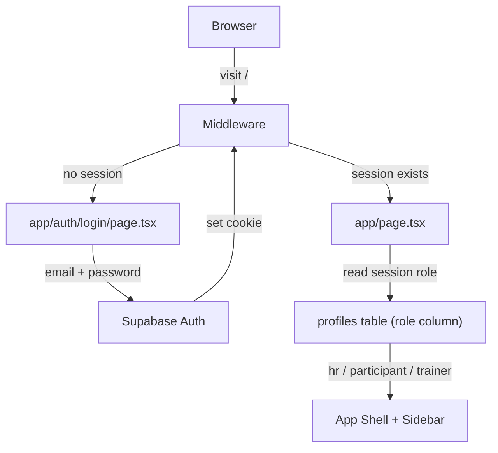
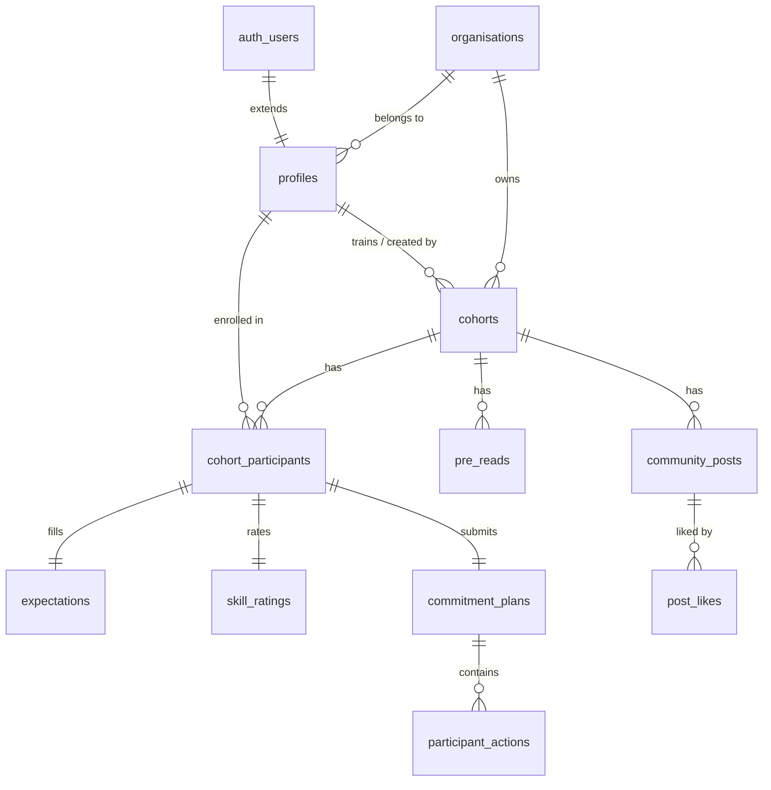

# Supabase Auth + Database — Phase-wise Plan

## Architecture Overview




**Role resolution flow:** On login, `profiles.role` is read → stored in React context → the sidebar shows navigation for that role only. The current role switcher popup in `[app/components/Sidebar.tsx](app/components/Sidebar.tsx)` is removed.

---

## Database Schema




---

## Phase 1 — Auth + Role Identity

**Goal:** Replace mock role switcher with real Supabase login. Users can only see their role's UI.

### New files

- `lib/supabase/client.ts` — browser Supabase client (`createBrowserClient`)
- `lib/supabase/server.ts` — server Supabase client (`createServerClient` with cookies)
- `middleware.ts` — session refresh on every request; redirect unauthenticated to `/auth/login`
- `app/auth/login/page.tsx` — email/password login form with Nudgeable branding
- `app/auth/layout.tsx` — centered layout (no sidebar) for auth pages
- `app/context/AuthContext.tsx` — React context providing `{ user, profile, role, signOut }`
- `supabase/migrations/001_auth_profiles.sql` — schema below

### Schema (Phase 1)

```sql
create table organisations (
  id uuid primary key default gen_random_uuid(),
  name text not null,
  created_at timestamptz default now()
);

create table profiles (
  id uuid primary key references auth.users(id) on delete cascade,
  organisation_id uuid references organisations(id),
  full_name text,
  role text check (role in ('hr','participant','trainer')) not null,
  avatar_initials text,
  created_at timestamptz default now()
);

-- Auto-create profile on signup
create or replace function handle_new_user()
returns trigger as $$
begin
  insert into profiles(id, role) values (new.id, 'participant');
  return new;
end;
$$ language plpgsql security definer;

create trigger on_auth_user_created
  after insert on auth.users
  for each row execute function handle_new_user();
```

### Files modified

- `[app/page.tsx](app/page.tsx)` — remove `useState` role; read `role` from `AuthContext` instead
- `[app/layout.tsx](app/layout.tsx)` — wrap `<body>` with `<AuthProvider>`
- `[app/components/Sidebar.tsx](app/components/Sidebar.tsx)` — remove role popup & `onSwitchRole`; show user name/initials from profile; add Sign Out button
- `[app/types.ts](app/types.ts)` — add `Profile` interface

### Packages to install

```
@supabase/supabase-js  @supabase/ssr
```

### Seed users (for testing)

3 accounts in Supabase Dashboard:

- `hr@demo.com` → `profiles.role = 'hr'`
- `participant@demo.com` → `profiles.role = 'participant'`
- `trainer@demo.com` → `profiles.role = 'trainer'`

---

## Phase 2 — HR Data Layer

**Goal:** Wire all HR screens to real Supabase data. HR can create cohorts, view analytics.

### New schema tables

```sql
create table cohorts (
  id uuid primary key default gen_random_uuid(),
  organisation_id uuid references organisations(id),
  name text not null,
  trainer_id uuid references profiles(id),
  training_date date,
  duration text,
  phase text check (phase in ('pre','live','post','completed')) default 'pre',
  created_by uuid references profiles(id),
  created_at timestamptz default now()
);

create table cohort_participants (
  cohort_id uuid references cohorts(id) on delete cascade,
  participant_id uuid references profiles(id),
  confirmed_attendance boolean default false,
  primary key (cohort_id, participant_id)
);
```

### Row Level Security

- HR can read/write cohorts where `organisation_id` matches their profile
- Participants can read cohorts they are enrolled in

### Files modified / created

- `[app/components/hr/LDImpact.tsx](app/components/hr/LDImpact.tsx)` — fetch cohort counts + metrics from Supabase
- `[app/components/hr/CohortList.tsx](app/components/hr/CohortList.tsx)` — fetch cohorts list
- `[app/components/hr/CreateCohort.tsx](app/components/hr/CreateCohort.tsx)` — `supabase.from('cohorts').insert(...)` on submit
- `[app/components/hr/DetailPost.tsx](app/components/hr/DetailPost.tsx)` / `DetailPre.tsx` / `DetailLive.tsx` — receive `cohortId` prop, fetch from `cohorts` + `cohort_participants`
- `lib/queries/cohorts.ts` — shared query helpers (`getCohorts`, `getCohortById`, etc.)

---

## Phase 3 — Participant Data Layer

**Goal:** Wire all pre-training, training day, and post-training participant screens to real data.

### New schema tables

```sql
create table expectations (id, participant_id, cohort_id, challenge, skill_improvement, success_definition, created_at);
create table skill_ratings (id, participant_id, cohort_id, rating int, created_at);
create table intros (id, participant_id, cohort_id, role_text, goal, fun_fact, created_at);
create table pre_reads (id, cohort_id, title, file_url, display_order int);
create table pre_read_completions (pre_read_id, participant_id, read_at, primary key (pre_read_id, participant_id));
create table commitment_plans (id, participant_id, cohort_id, commitment, why, blockers, is_public bool default false, created_at);
create table actions (id, cohort_id, category text, action_text text, is_custom bool default false);
create table participant_actions (id, participant_id, cohort_id, action_id, status text default 'pending', completed_at, xp_earned int default 0);
create table buddy_pairs (cohort_id, participant_id, buddy_id, primary key (cohort_id, participant_id));
```

### Files modified

- All `app/components/participant/*.tsx` files — replace hardcoded data with Supabase reads/writes
- `lib/queries/participant.ts` — query helpers for participant data
- `app/context/CohortContext.tsx` — provides `activeCohortId` to all participant screens

---

## Phase 4 — Trainer + Community

**Goal:** Wire trainer views to real participant data; add live community feed with Supabase Realtime.

### New schema tables

```sql
create table community_posts (id, cohort_id, author_id, content, phase text, is_public bool, created_at);
create table post_likes (post_id, user_id, primary key (post_id, user_id));
```

### Key additions

- `[app/components/trainer/TrainerViews.tsx](app/components/trainer/TrainerViews.tsx)` — read expectations, skill_ratings, participant_actions from Supabase
- `[app/components/participant/Community.tsx](app/components/participant/Community.tsx)` + `[Social.tsx](app/components/participant/Social.tsx)` — use `supabase.channel()` for real-time post updates
- `lib/queries/trainer.ts` — trainer-specific query helpers

---

## Phase 5 — AI + File Storage (Advanced)

**Goal:** Connect AI action plan generation and session brief to real data via Next.js API routes + Supabase Storage.

- `app/api/generate-actions/route.ts` — calls OpenAI with participant commitment, returns action suggestions
- `app/api/session-brief/route.ts` — calls OpenAI with aggregated expectations/skill data for trainer brief
- Supabase Storage bucket `training-files` for pre-reads and training content uploads

---

## Key Structural Changes Summary


| What changes                          | Why                                          |
| ------------------------------------- | -------------------------------------------- |
| Remove role switcher popup in Sidebar | Role comes from `profiles.role` via auth     |
| Add `/auth/login` route               | Entry point for all users                    |
| Add `middleware.ts`                   | Protect all routes except `/auth/`*          |
| Add `AuthContext`                     | Share user/role across all client components |
| Add `lib/supabase/`                   | Centralize Supabase client setup             |
| Add `lib/queries/`                    | Centralize all DB query logic                |
| Add `supabase/migrations/`            | Track schema changes                         |


